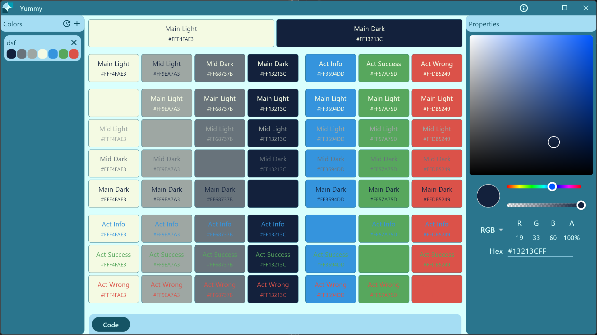

# Yummy

Yummy - The color palette generator for Flutter.

You can change two main colors: MainLight and MainDark, and get Yummy color palette.

The Yummy app generates ThemeData code for Light and Dark theme and also the AppColors class with all colors constants.

You need only paste the code in your project and enjoy ❤️.
